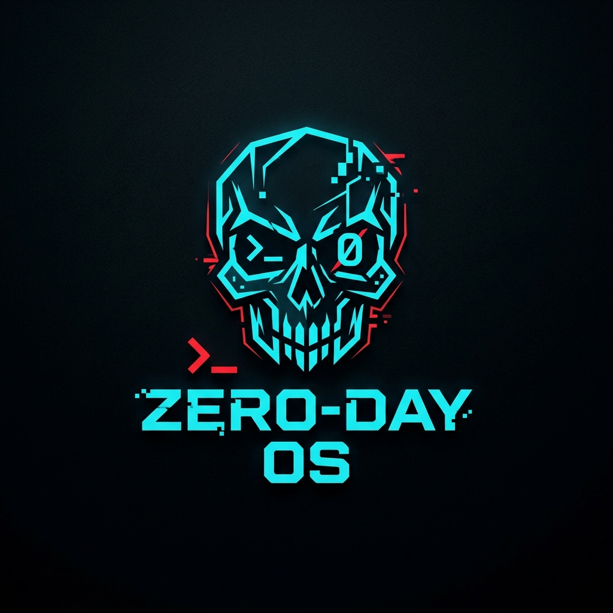

# ZERO-DAY OS

<p align="center">
  
</p>

**The first penetration testing OS built for a credit-card-sized computer you can hold in one hand.**

ZERO-DAY OS v1.0.1 turns the M5Stack Cardputer Zero — a quad-core ARM box with WiFi, BT, Ethernet, IR, a camera, a battery, and a built-in keyboard — into a pocketable offensive security weapon. Every byte of this distro is optimized for the constraints of 512MB RAM and a 1.9" screen. No desktop. No bloat. No compromises.

---

## What Makes This Different

You can install Kali on a Raspberry Pi. That's not what this is.

| Stock Pi + Kali | ZERO-DAY OS |
|---|---|
| Boots into a desktop you can't use on 1.9" | Boots straight into a Pygame GUI launcher |
| 2GB+ RAM just for the DE | ~60MB idle, 512MB total — 450MB for tools |
| Mouse required | 46-key Omni-Key system — zero mouse needed |
| Tools are menu items you click | Tools are **2 keystrokes away** from anywhere |
| CLI needed for file management | Native D-Pad File Explorer built directly into Pygame |
| No hardware awareness | IR, camera, IMU, battery — all weaponized |
| Close lid, pray | Press `Fn + P` — everything dies and sanitizes instantly |
| You carry a laptop bag | You carry a credit card |

---

## The Constraints We Solved

The Cardputer Zero is an incredible machine with brutal constraints. Every design decision in ZERO-DAY OS exists because of one of these:

| Constraint | Our Solution |
|---|---|
| **512MB RAM** | `musl` where possible, `dropbear` over `sshd`, no `postgres`, no heavy daemons. Metasploit excluded. |
| **1.9" 320×170 display** | Pygame SDL2 drill-down GUI — no desktop, Premium 1x1 Carousel Menu with fluid Lerp physics, 13 categories, tactile audio feedback. |
| **46-key matrix keyboard** | `Fn` Omni-Key system. Every tool is 2 keypresses from anywhere. No chording hell. |
| **1500mAh battery** | Three power profiles (performance / balanced / stealth). `autosleep`. Radio toggle hotkeys. |
| **No mouse, ever** | `i3` tiling WM backend. tmux splits. Arrow-key everything. |
| **Credit-card size (85×54mm)** | No external dongles needed. IR, BT, WiFi, Ethernet, camera — all on-board. |

---

## Architecture

```
 ┌──────────────────────────────────────────────────────────┐
 │                    ZERO-DAY OS STACK                      │
 ├──────────────────────────────────────────────────────────┤
 │                                                          │
│   ┌─────────────────────────────────────────────────┐    │
│   │           FLIPPER GUI  ·  Pygame (SDL2)        │    │
 │   │                                                   │    │
│   │   ┌─────┐ ┌─────┐ ┌─────┐ ┌─────┐ ┌─────┐     │    │
│   │   │WIFI │ │M5MON│ │ NET │ │  BT │ │  IR │     │    │  ← Level 1: Grid
│   │   └─────┘ └─────┘ └─────┘ └─────┘ └─────┘     │    │
│   │   ┌─────┐ ┌─────┐ ┌─────┐ ┌─────┐ ┌─────┐     │    │
│   │   │ CAM │ │PAYLD│ │RADIO│ │MEDIA│ │SHELL│     │    │
│   │   └─────┘ └─────┘ └─────┘ └─────┘ └─────┘     │    │
│   │   ┌─────┐ ┌────────┐ ┌─────┐                     │    │
│   │   │ SYS │ │OPENCODE│ │OPEN │                     │    │
│   │   └─────┘ └────────┘ └─────┘                     │    │
 │   │                                                   │    │
 │   │        ┌──────────────────────┐                   │    │
 │   │        │  Tool List Scroll    │                   │    │  ← Level 2: Tools
 │   │        └──────────────────────┘                   │    │
 │   │        ┌──────────────────────┐                   │    │
 │   │        │  Guided Actions      │                   │    │  ← Level 3: Presets
 │   │        └──────────────────────┘                   │    │
 │   │                                                   │    │
 │   └─────────────────────────────────────────────────┘    │
 │                                                           │
 │   ┌───────────┐  ┌───────────┐  ┌───────────────────┐   │
 │   │  i3 wm    │  │  OpenCode │  │  Panic System      │   │
 │   │ (tiling)  │  │  (editor) │  │  (kill + wipe)     │   │
 │   └───────────┘  └───────────┘  └───────────────────┘   │
 │                                                           │
 │   ┌─────────────────────────────────────────────────┐    │
│   │   One-Key Hacking Scripts  /usr/local/bin       │    │
│   │   wifi-* · net-* · bt-* · ir-* · cam-*          │    │
│   │   revshell-* · quick-c2 · tunnel-mgr · iot-scan │    │
│   │   mac-rotate · loot-organize · doh-proxy · panic │    │
 │   └─────────────────────────────────────────────────┘    │
 │                                                           │
 │   ┌─────────────────────────────────────────────────┐    │
│   │   Debian minimal  +  Kali Rolling repos          │    │
│   │   aircrack · nmap · bettercap · sqlmap · john    │    │
│   │   hydra · gobuster · dsniff · responder · curl     │    │
│   │   hashcat-utils · hcxdumptool · strace · macchanger│  │
 │   └─────────────────────────────────────────────────┘    │
 │                                                           │
 │   ┌─────────────────────────────────────────────────┐    │
 │   │   CM0 Device Tree Overlays                       │    │
 │   │   SPI (LCD) · I2C (IMU,battery,RTC) · I2S (audio)│   │
 │   │   CSI (camera) · GPIO (IR,kbd) · SDIO (WiFi)     │    │
 │   └─────────────────────────────────────────────────┘    │
 │                                                           │
 └──────────────────────────────────────────────────────────┘
```

---

## OpenCode — Your Pocket IDE

OpenCode is a first-class app on ZERO-DAY OS — an AI-assisted code editor and terminal you launch with `Fn + O`. It's not the brain of the distro. It's your workshop inside it.

When you're standing in a parking lot at 2am with a 1.9" screen and no laptop, you need to:
- **Edit attack scripts** on the fly — tweak a bettercap filter, modify a payload before sending
- **Write one-off tools** for targets that don't fit the pre-loaded arsenal
- **Read captured data** — handshakes, scan results, logs — and decide your next move
- **Debug running scripts** with the live console split below your editor

### opencode-session
```bash
opencode-session                        # Full workspace — editor top, console bottom
opencode-session /opt/cardputer r1      # Jump to specific file
opencode-session /path/to/dir filename  # Custom location
```

A tmux split: 70% editor on top, 30% live console on bottom. Workspace lives at `/opt/cardputer/workspace/`.

### Launching
| Method | How |
|---|---|
| **From the TUI** | Navigate to `[OPEN]` tile on the Flipper grid, press Enter |
| **From anywhere** | `Fn + O` — instant full-screen OpenCode |
| **From terminal** | Run `opencode-session` |

---

## Tool Arsenal

Every tool chosen for **sub-100MB RAM at idle**. No fat daemons. No database servers. Metasploit is excluded (requires 1GB+ RAM). You have `john` for on-device cracking and `hashcat-utils` for off-device GPU cracking prep.

### WiFi Offense
| Command | Description |
|---|---|
| `sudo wifi-scan <iface>` | Quick survey — list all APs, channels, encryption |
| `sudo wifi-survey-log <iface> [duration]` | Continuous WiFi AP logger (wardriving without GPS) |
| `sudo wifi-deauth <iface> <bssid> <chan>` | Monitor mode + deauth attack |
| `sudo wifi-handshake <iface> <bssid> <chan>` | Capture WPA handshakes → `/opt/cardputer/handshakes/` |
| `sudo wifi-pmkid <iface> <bssid> <chan>` | PMKID capture via hcxdumptool (no client needed) |
| `sudo wifi-evil-twin <ap> <inet> <essid>` | Rogue AP: hostapd + dnsmasq + NAT |
| `sudo wifi-crack <cap>` | Crack captured handshakes (john/aircrack) |
| `sudo wifi-monitor-toggle` | Toggle managed/monitor mode |
| `sudo mac-rotate <iface> random` | Randomize MAC address |
| `sudo mac-rotate <iface> restore` | Restore original MAC |
| `mac-rotate <iface> status` | Show current MAC status |

### Network Recon & Attack
| Command | Description |
|---|---|
| `sudo net-discover <iface> [subnet]` | ARP scan + ping sweep |
| `net-quickscan <target> [profile]` | Nmap scan: quick/web/full/stealth/vuln |
| `sudo net-vulnscan <target>` | Nmap vuln → nikto → whatweb |
| `iot-scan <target> [mode]` | IoT-focused Nmap presets (cameras/bacnet/modbus) |
| `gobuster` | Directory/DNS/vhost brute-forcer |
| `sudo arpspoof <target>` | MITM via ARP spoofing (from dsniff) |
| `responder` | LLMNR/NBT-NS poisoner (credential harvester) |
| `tunnel-mgr socks <host> [port]` | Managed SOCKS proxy (auto-reconnect) |
| `tunnel-mgr forward <lport> <rhost:rport> <ssh>` | Local port forward |
| `tunnel-mgr reverse <rport> <lport> <ssh>` | Remote port forward |
| `tunnel-mgr list` | List active tunnels |
| `quick-c2 listen [port]` | Encrypted C2 listener (socat + OpenSSL) |
| `quick-c2 payload <type> [ip] [port]` | Generate shell one-liners (bash/py/sh/nc/ps) |
| `sudo doh-proxy start [server] [port]` | DNS-over-HTTPS proxy (evade DNS monitoring) |

### Bluetooth
| Command | Description |
|---|---|
| `sudo bt-scan` | BLE + Classic discovery |
| `sudo bt-deep <mac>` | Deep enumerate: name, class, SDP, LMP |
| `sudo bt-attack <type> [mac]` | BlueBorne / l2ping flood / RFCOMM scan |
| `sudo ble-gatt <mac>` | GATT service + handle enumeration |
| `sudo bettercap` | Swiss-army MITM framework (WiFi + BLE) |

### Exploitation
| Command | Description |
|---|---|
| `john <hashfile>` | Password cracker (MD5, SHA, bcrypt, NTLM, DES) |
| `hydra <target> <protocol> <userlist> <passlist>` | Online credential brute-forcer |
| `hashcat-utils` | Handshake converters (cap2hccapx, off-device cracking) |
| `searchsploit <keyword>` | ExploitDB search |
| `sqlmap <options>` | SQL injection tool |
| `strace -p <pid>` | Syscall tracer (debug why tools fail) |

### IR — Infrared Hacking
| Command | Description |
|---|---|
| `sudo ir-scan` | Capture and decode IR signals from any remote |
| `sudo ir-replay <signal_file>` | Replay captured signals — take over TVs, ACs, projectors |
| `sudo ir-brute <protocol> [device]` | Brute-force IR power codes — turn off every TV in the building |

### Camera — Physical Recon
| Command | Description |
|---|---|
| `cam-snap [output]` | Capture a still image → `/opt/cardputer/loot/cam/` |
| `cam-stream [duration]` | Record a video clip (H.264 @ 1080p30) |
| `cam-ocr [output]` | Capture + Tesseract OCR — read badges, screens, documents on sight |

### Hardware & Radio
| Command | Description |
|---|---|
| `sudo sdr-scan [freq_range]` | RTL-SDR frequency scan — listen to everything |
| `sudo gpio-probe` | Enumerate I2C/SPI/UART devices on expansion port |
| `sudo rf-capture [freq]` | Raw RF capture and analysis |
| `mesh-chat chat` | Interactive off-grid Meshtastic LoRa chat UI |
| `mesh-chat nodes` | List discovered LoRa mesh nodes |

### System & Field Ops
| Command | Description |
|---|---|
| `panic` | KILL EVERYTHING — kill processes, wipe history, sanitize, block radios |
| `mac-rotate <iface> random` | Randomize MAC address (stealth) |
| `mac-rotate <iface> restore` | Restore original MAC |
| `loot-organize` | Sort and compress captured loot by type |
| `loot-organize status` | Show loot directory summary |
| `loot-organize compress` | Gzip files older than 7 days |
| `doh-proxy start [server] [port]` | DNS-over-HTTPS proxy (evade DNS monitoring) |
| `doh-proxy stop` | Stop DoH proxy |
| `cardputer-wifi-toggle` | Toggle `wlan0` on/off (saves battery, goes dark) |
| `power-mode <profile>` | Switch power profile (see below) |
| `cardputer-wifi-setup` | Interactive WiFi configurator |
| `cardputer-battery` | Read BQ27220 fuel gauge — voltage, %, time remaining |

---

## Keyboard Map — The Omni-Key System

46 keys. One `Fn` key. Zero mouse. Every action is 2 keypresses from anywhere.

```
 ┌─────────────────────────────────────────────┐
 │  Fn + Tab   → Flipper TUI toggle            │
 │  Fn + P     → PANIC (kill all + wipe)       │
 │  Fn + Space → STEALTH (kill backlight)      │
 │  Fn + Return→ Quick terminal                │
 │  Fn + Q     → Close tile                    │
 │  Fn + O     → OpenCode                      │
 │                                              │
 │  Fn + N     → Nmap QuickScan                 │
 │  Fn + B     → Bluetooth scan                │
 │  Fn + S     → Shell listener                │
 │  Fn + W     → WiFi monitor toggle           │
 │  Fn + C     → Camera snap                   │
 │  Fn + I     → IR scan                       │
 │  Fn + A     → opencode-ask                  │
 └─────────────────────────────────────────────┘
```

Inside the Flipper TUI:
| Key | Action |
|---|---|
| `↑ ↓ ← →` | Navigate grid and lists |
| `Enter` | Drill into category or execute action |
| `Esc` | Go back one level / exit |

---

## Field Workflows

Real scenarios. Real keypresses.

### Walk into a building, own the WiFi
```
Fn + Tab          → Open TUI
[WIFI] + Enter    → WiFi category
[Handshake]       → "Quick Scan" → pick target
                   → "Capture Handshake" → .cap saved
Fn + P             → PANIC — everything gone
```

### Plug into Ethernet, own the network
```
Fn + Tab          → Open TUI
[NET] + Enter     → Network category
[Discover]        → ARP sweep finds 47 hosts
[QuickScan]        → Nmap vuln scan — 3 targets with SMB open
Fn + S             → Spin up a shell listener
[Payloads]         → Generate payload for target arch
```

### Physical recon with camera
```
Fn + C             → Camera snap — photograph badge/screen
cam-ocr             → OCR the image — extract text
revshell-gen bash <ip> 4444  → Get a shell one-liner
```

### Turn off every TV in the room
```
Fn + Tab          → Open TUI
[IR] + Enter      → IR category
[Brute]            → "TV Power" → IR transceiver blasts every code
                   → Silence.
```

### Get caught? Vanish.
```
Fn + P             → PANIC
                    → Kills: aircrack, bettercap, nmap, john, hydra, all shells
                   → Wipes: bash history, tmux sessions, /tmp/*
                   → Clears: screen buffer
                   → Result: clean terminal, zero evidence on screen
Fn + Space         → STEALTH (backlight off, device looks powered down)
```

---

## Loot Directory

Every captured artifact, organized:

```
/opt/cardputer/
├── handshakes/         # WPA .cap files — ready for john/hashcat
├── pmkid/              # PMKID hashes (hashcat mode 22000)
├── payloads/           # Generated payloads (quick-c2 output)
├── workspace/          # OpenCode working directory
├── music/              # Local music files (mp3/flac/wav/ogg)
├── loot/
│   ├── wifi/           # WiFi scan logs, survey captures
│   ├── recon/          # Nmap XML/text, nikto reports
│   ├── bt/             # Bluetooth enumeration dumps
│   ├── ble/            # BLE GATT handle dumps
│   ├── ir/             # Captured IR signals (replay-ready)
│   ├── cam/            # Camera captures + OCR output
│   ├── rf/             # SDR/RF captures
│   ├── nfc/            # NFC tag dumps and clones
│   ├── creds/          # Captured credentials and hashes
│   ├── net/            # Network captures and tunnel logs
│   └── general/        # Uncategorized loot
└── config/
    ├── attack-profiles/    # Saved TUI presets (target profiles)
    ├── wordlists/          # Seclists + custom wordlists
    ├── mac-backup/        # Saved original MAC addresses
    ├── c2/                # C2 TLS certificates
    ├── meshtastic/        # Meshtastic node config
    └── doh/               # DoH proxy config
```

---

## Hardware — Fully Weaponized

Every sensor and radio on the Cardputer Zero is mapped and ready:

| Hardware | Interface | Offensive Use |
|---|---|---|
| **1.9" LCD (ST7789v3)** | SPI | Flipper-style TUI — 3-level drill-down, no wasted pixels |
| **46-key matrix** | I2C + GPIO | Omni-Key system — every tool 2 keys away |
| **WiFi (802.11 b/g/n)** | SDIO | Monitor mode, deauth, handshakes, evil twin |
| **Bluetooth 4.2 / BLE** | UART | Device enumeration, BlueBorne, GATT exploration |
| **10/100 Ethernet** | RMII | Wired network access, ARP spoofing, pivoting |
| **IR Transceiver** | GPIO | Capture & replay remotes, brute-force power codes |
| **IMX219 Camera (8MP)** | CSI (4-lane) | Physical recon, badge OCR, surveillance |
| **BMI270 IMU** | I2C | Tamper detection — auto-lock/auto-wipe on movement |
| **BQ27220 Fuel Gauge** | I2C | Real-time battery %, voltage, estimated runtime |
| **ES8389 Audio Codec** | I2S | MEMS mic for audio capture, 1W speaker for alerts |
| **RX8130CE RTC** | I2C | Hardware clock — accurate timestamps across reboots |
| **USB-A Host** | USB 2.0 | Rubber ducky, Bash Bunny, RTL-SDR, external NIC |
| **USB-C Host** | USB 2.0 | Same — dual USB host |
| **USB-C Device** | USB 2.0 | Plug into victim PC → reverse shell / HID attack |
| **Expansion Port** | HY2.0-4P + 2.54-14P | GPIO, SPI, I2C, UART — connect anything |

### Expansion Modules & Dual-Wielding
The Cardputer Zero features two distinct expansion interfaces that can be used simultaneously:
1. **The Grove Port (HY2.0-4P):** I2C / UART. Perfect for attaching the **MonsterC5** board for advanced Wi-Fi attacks.
2. **The GPIO Header (ExtPort 2.54-14P):** Perfect for stacking M5Stack CAP modules. 

You can "dual-wield" by plugging the MonsterC5 into the Grove port, while simultaneously connecting **one** CAP module to the GPIO header. 
*Note: Because CAPs use the same physical GPIO header, you cannot stack the LoRa Meshtastic CAP and the CC1101/NFC subGHz CAP at the same time. You must choose one CAP to run alongside the MonsterC5.*

### USB-C Device Mode — The Silent Vector
The switchable USB-C port is the most dangerous feature nobody talks about. Flip the switch and the Cardputer Zero becomes a **USB device**:
- Plug into a victim's computer → enumerate as HID keyboard → execute payload
- Plug into a locked workstation → USB Rubber Ducky attack
- Plug into a server → `usbmuxd` / `libimobiledevice` for iOS extraction

### Power Profiles
```bash
sudo power-mode performance   # 1GHz quad, all radios, all cores — ~4hr battery
sudo power-mode balanced      # 800MHz, BT off, WiFi on — ~6hr battery
sudo power-mode stealth       # 600MHz single core, WiFi off, IR off, screen dim — ~10hr battery
```

### Tamper Detection
The BMI270 IMU isn't a gimmick. In stealth mode:
- Device is moved → auto-lock terminal, require password to resume
- Device is shaken/dropped → auto-wipe `/opt/cardputer/loot/` and `.bash_history`
- Customizable threshold via `/opt/cardputer/config/tamper.conf`

---

## Panic System — The Kill Switch

This isn't just `kill -9`. The panic key (`Fn + P`) is designed for the moment someone looks over your shoulder:

**What happens in 0.3 seconds:**
1. `kill -9` every offensive process (aircrack, bettercap, nmap, john, hydra, all shells)
2. Wipe `~/.bash_history`, `/tmp/*`, tmux session history
3. Clear screen buffer — terminal shows only a login prompt
4. Log the panic event with timestamp to `/opt/cardputer/panic.log`

**Then press `Fn + Space` for STEALTH mode:**
- Backlight killed — device appears powered off
- WiFi radio off — no RF emissions
- Any key press wakes the screen, no evidence remains

---

## Building the OS Image

Built from scratch using Docker for full reproducibility.

### Prerequisites (x86 Linux Host)

ARM emulation required to build on x86:

**Arch Linux / CachyOS:**
```bash
sudo pacman -S qemu-user-static binfmt-support
sudo systemctl enable --now systemd-binfmt
```

**Debian / Ubuntu:**
```bash
sudo apt install qemu-user-static binfmt-support
```

### Build
```bash
cd pi-gen
./build-docker.sh
# 30min–2hr. Downloads Debian base + Kali tools. Go get coffee.
```

Retrieve `.img` from `pi-gen/deploy/` and flash to a **32GB+ microSD** via BalenaEtcher or `dd`:
```bash
sudo dd if=zeroday-os.img of=/dev/sdX bs=4M status=progress conv=fsync
```

### First Boot
1. Login: `root` / `zeroday` — **change immediately**: `passwd`
2. Configure WiFi: `cardputer-wifi-setup`
3. Launch the TUI: `Fn + Tab` or run `cyber_launcher`
4. Open OpenCode: `Fn + O` or run `opencode-session`

---

## Threat Model & Ethics

ZERO-DAY OS is a professional tool for **authorized security testing**. The panic key exists because real pentesters sometimes need to disappear fast. All actions are logged locally for your engagement report.

**Do not use this on networks or devices you don't own or have explicit written authorization to test.**

---

## Credits

- **M5Stack** — Cardputer Zero hardware
- **Raspberry Pi Foundation** — CM0 and pi-gen
- **Kali Linux** — Tool repositories
- **OpenCode** — On-device AI-assisted code editor
- **Offensive Security** — Training and tool ecosystem
- **The Flipper Zero community** — TUI design inspiration

---

<p align="center">
<strong>Built for the field. Designed for the edge. Fits in your wallet.</strong>
</p>
